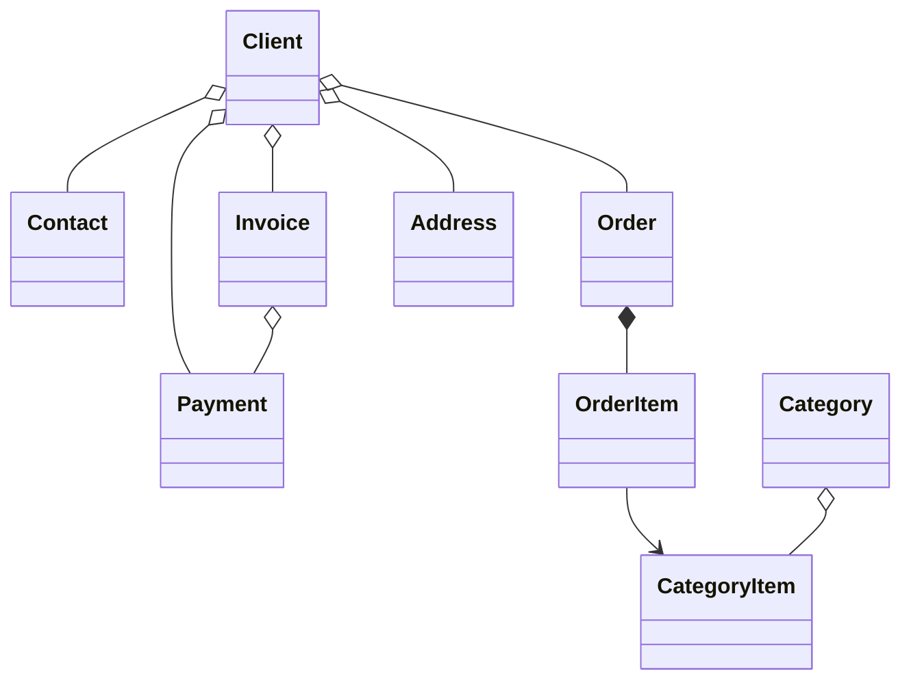

#  B2B CRM

### Is a [Jmix](https://jmix.io) application for managing client relationships

## 📑 Table of Contents

- [Overview](#overview)
- [Technical stack](#technical-stack)
- [Add-ons in use](#add-ons-in-use)
- [Build and run](#build-and-run)
- [Demo data](#demo-data)
- [Accounts](#application-accounts)
- [Domain Model](#domain-model)
- [Role Model](#role-model)

## 📖 Overview

This project models a typical B2B sales workflow:

- Manage catalog of your products and categories
- Maintain clients and contacts
- Track orders and order items
- Issue invoices and record payments
- Monitor tasks and recent activities
- See sales analytics

## 🛠️ Technical Stack

- Java 21
- Jmix 2.7
- Spring Boot 3
- HSQLDB

## 🧩 Add-ons

- Audit
- Application settings
- Charts
- Data tools
- Dynamic attributes
- Grid export
- Local file storage
- Reports (includes an invoice template)

## 🚀 Build and Run

Prerequisites: Java 21+

### Run Project

1. Run [B2B CRM](.run/b2b-app.run.xml) Jmix run configuration or execute

   ```bash
   ./gradlew bootRun
   ```

2. [Open application URL](http://localhost:8080/crm)

### Run via JAR:

```bash
./gradlew bootJar -Pvaadin.productionMode
```

```bash
java -jar build/libs/crm.jar
```

### Run via Docker

```bash
docker build -t jmix-crm .
```

```bash
docker run --rm -p 8080:8080 jmix-crm
```

### Run via Docker Compose

```bash
docker-compose up
```

## 🎲 Demo Data

The local profile generates demo data on the application start:

- You can disable demo data generation with `crm.generateDemoData` property
  in [application.properties](src/main/resources/application.properties)
- Catalog imported from [catalog.xlsx](src/main/resources/demo-data/catalog.xlsx)

## 👥 Application Accounts

| Position      | Username         | Password   |
|---------------|------------------|------------|
| Administrator | ```admin```      | admin      |
| Supervisor    | ```supervisor``` | supervisor |
| Manager       | ```manager```    | manager    |

## ⚙️ Domain Model



## 🔐 Role Model

The application uses a hierarchical role model:

- `Administrator`: Full access to all application features, entities, and settings.
- `Supervisor`: Extends the Manager role with additional administrative capabilities:
    - Manage product catalog (Categories and Category Items).
    - Assign Account Managers to Clients.
- `Manager`: Primary role for sales operations.
    - Full access to Clients, Contacts, Orders, Invoices, and Payments.
    - Read-only access to the product catalog.
    - Manage own Tasks.
- `UI Minimal`: Minimal access, allowing login and basic navigation.
