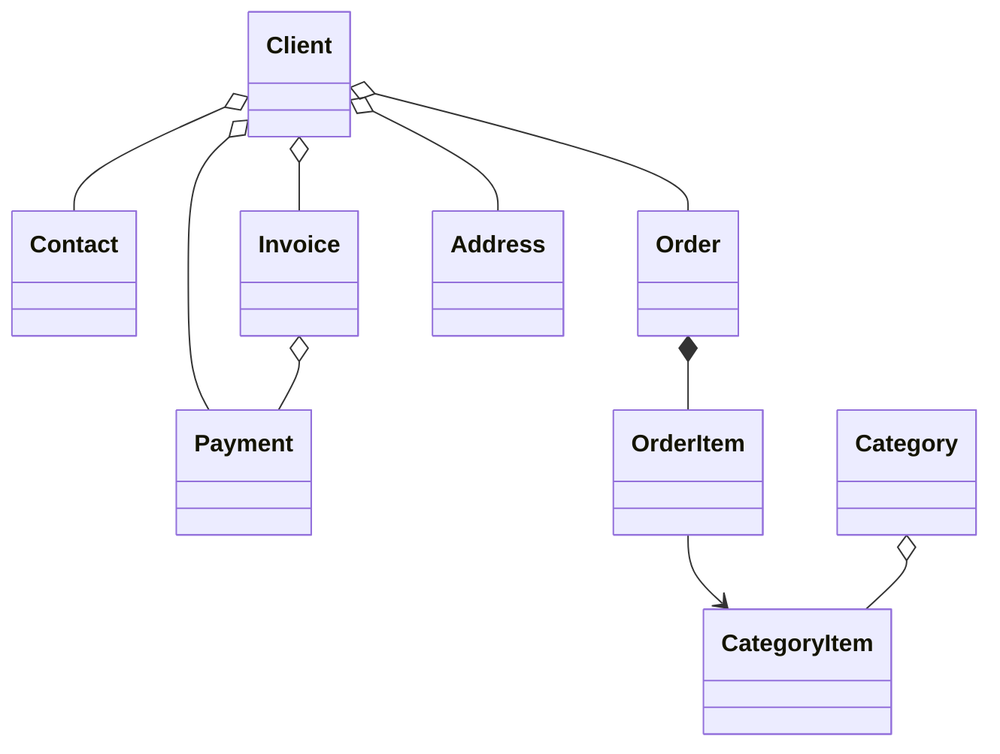

#  B2B CRM

🖥️ [Online Demo](https://demo.jmix.io/b2b-crm/login)

🌐 Languages: [English](README.md) | [Русский](readme/README_ru.md) | [Deutsch](readme/README_de.md) | [Italiano](readme/README_it.md) | [Español](readme/README_es.md) | [Tiếng Việt](readme/README_vi.md) | [Srpski](readme/README_sr.md)

`B2B CRM` is an enterprise demo application based on `Jmix framework` with built-in `AI` that showcases how to develop production-ready business systems including `customers`, `orders`, `invoicing`, `finance` and `analytics`. 

## 📑 Table of Contents

- [Technical Stack](#-technical-stack)
- [Overview](#-overview)
- [AI Assistant](#-ai-assistant)
- [Add-ons](#-add-ons)
- [Build & Run](#-build-and-run)
- [Demo Data](#-demo-data)
- [Accounts](#-application-accounts)
- [Domain Model](#-domain-model)
- [Role Model](#-role-model)
- [More About Jmix](#-more-about-jmix)
- [FAQ](#-faq)

## 🛠️ Technical Stack

- Java 21
- Jmix (Spring Boot & Vaadin Flow)
- HSQLDB

## 📖 Overview

This project models a typical B2B sales workflow:

- Manage the catalog of your products and categories
- Maintain clients and contacts
- Track orders and order items
- Issue invoices and record payments
- Ask an AI assistant for business insights
- Monitor tasks and recent activities
- See sales analytics

## 🤖 AI Assistant

The application includes a built-in `CRM AI` workspace for natural-language analysis of CRM data.

Key capabilities:

- Ask business questions about clients, orders, invoices, payments, and sales performance
- Respect the current user's data access permissions and keep conversations private to their author
- Use built-in business reports such as `Client 360 Report` and `Category Cashflow Risk Allocation Report`
- Keep the conversation history with automatically generated chat titles
- Upload files to the conversation and let the assistant analyze supported documents and images
- Generate interactive links to CRM records directly in responses

Configuration:

- Set `spring.ai.openai.api-key` in [application.properties](src/main/resources/application.properties) or provide the `SPRING_AI_OPENAI_APIKEY` environment variable

When enabled, open the `CRM AI` item in the main menu to start a new conversation.

## 🧩 Add-ons

- [AI Tools](https://www.jmix.io/marketplace/ai-tools/)
- [Audit](https://www.jmix.io/marketplace/audit/)
- [Application Settings](https://www.jmix.io/marketplace/application-settings/)
- [Charts](https://www.jmix.io/marketplace/charts/)
- [Data tools](https://www.jmix.io/marketplace/data-tools/)
- [Dynamic attributes](https://www.jmix.io/marketplace/dynamic-attributes/)
- [Grid export](https://www.jmix.io/marketplace/grid-export-actions/)
- [Reports](https://www.jmix.io/marketplace/reports/)
- Local file storage, Localizations

## 🚀 Build and Run

Prerequisites: Java 21+

### Run Project

1. Run [B2B CRM](.run/crm-app.run.xml) Jmix run configuration or execute

   ```bash
   ./gradlew bootRun
   ```

2. [Open application URL](http://localhost:8080/b2b-crm)

### Run via JAR:

```bash
./gradlew bootJar -Pvaadin.productionMode
```

```bash
java -jar build/libs/crm.jar
```

### Run via Docker

```bash
docker build -t jmix-crm .
```

```bash
docker run --rm -p 8080:8080 jmix-crm
```

### Run via Docker Compose

```bash
docker-compose up
```

## 🎲 Demo Data

The local profile generates demo data on the application start:

- You can disable demo data generation with `crm.generateDemoData` property
  in [application.properties](src/main/resources/application.properties)
- Catalog imported from [catalog.xlsx](src/main/resources/demo-data/catalog.xlsx)

## 👥 Application Accounts

| Position        | Username      | Password | Access                                         |
|-----------------|---------------|----------|------------------------------------------------|
| Administrator   | ```admin```   | admin    | Full access to all data and settings           |
| Supervisor      | ```james```   | james    | Manager + catalog management + assign accounts |
| Manager         | ```manager``` | manager  | Full access to all clients and orders          |
| Account Manager | ```alice```   | alice    | Only sees clients assigned to Alice Brown      |
| Account Manager | ```robert```  | robert   | Only sees clients assigned to Robert Taylor    |

## ⚙️ Domain Model


```mermaid
classDiagram
    Client o-- Contact
    Client o-- Order
    Client o-- Invoice
    Client o-- Payment
    Client o-- Address

    Order *-- OrderItem
    OrderItem --> CategoryItem
    Category o-- CategoryItem

    Invoice o-- Payment
```

## 🔐 Role Model

The application uses a hierarchical role model:

- `Administrator`: Full access to all application features, entities, and settings.
- `Supervisor`: Extends the Manager role with additional administrative capabilities:
    - Manage product catalog (Categories and Category Items).
    - Assign Account Managers to Clients.
- `Manager`: Primary role for sales operations.
    - Full access to Clients, Contacts, Orders, Invoices, and Payments.
    - Read-only access to the product catalog.
    - Manage own Tasks.
- `UI Minimal`: Minimal access, allowing login and basic navigation.

## ℹ️ More about Jmix

- 🌐 Website: https://www.jmix.io/
- 📚 Documentation: https://docs.jmix.io/
- 💻 GitHub: https://github.com/jmix-framework/jmix
- 🎥 YouTube: https://www.youtube.com/@jmixframework
- 💬 Forum: https://forum.jmix.io/
- 💼 LinkedIn: https://www.linkedin.com/company/jmix-framework/

## 💬 FAQ 

> What is Jmix? 

Jmix is a full-stack open-source Java platform for enterprise software development with local and public models. 
It helps development teams build internal business applications faster while keeping full control over the source code, architecture, and deployment. Jmix combines Java, Spring Boot, enterprise UI, security, data access, visual development tools, and AI-assisted development in a single platform. 

Learn more: 
- https://www.jmix.io/  
- https://docs.jmix.io/  
- https://github.com/jmix-framework/jmix  

---

> Why is Jmix good for building CRM systems? 

CRM systems have become the backbone of modern enterprise automation, moving far beyond a simple system of records. As business requirements in sales change rapidly, CRM systems must also provide capabilities to implement quick changes in workflows, data model, and UX while preserving high security and compliance standards. 
Jmix provides these capabilities out of the box, allowing developers to focus on business logic instead of infrastructure. This demo demonstrates how production-ready enterprise applications can be developed using Jmix and AI. 

---

> Is this a real application or just a demo? 

B2B CRM is a demo application designed to demonstrate production-ready architecture and enterprise development practices. 
It includes real business scenarios, modern UI, AI capabilities, security, reporting, and integration patterns that can be reused in your own enterprise projects. 
