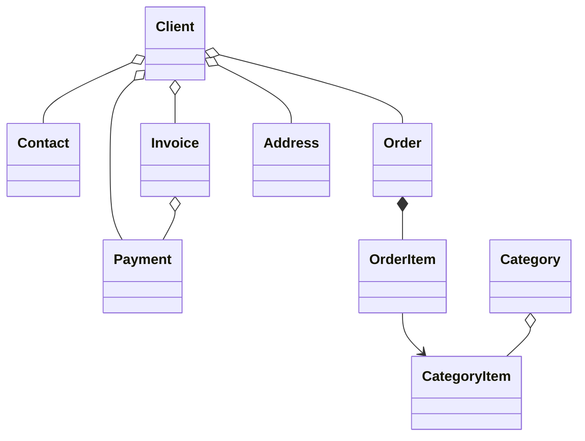

#  B2B CRM

Језици: [English](../README.md) | [Русский](README_ru.md) | [Deutsch](README_de.md) | [Italiano](README_it.md) | [Español](README_es.md) | [Tiếng Việt](README_vi.md) | [Српски](README_sr.md)

`B2B CRM` је демо апликација корпоративног нивоа изграђена помоћу Jmix-а која показује како развити пословне системе **спремне за продукцију**
укључујући `клијенте`, `поруџбине`, `фактурисање`, `финансије` и `аналитику`. <br>Одражава реалне **ERP/CRM** сценарије и демонстрира
најбоље праксе у моделовању домена, корисничком интерфејсу, безбедности и имплементацији пословне логике.

## 📑 Садржај

- [Преглед](#-преглед)
- [Технолошки стек](#-технолошки-стек)
- [Коришћени додаци](#-додаци)
- [Изградња и покретање](#-изградња-и-покретање)
- [AI асистент](#-ai-асистент)
- [Демо подаци](#-демо-подаци)
- [Налози](#-налози-апликације)
- [Модел домена](#-модел-домена)
- [Модел улога](#-модел-улога)

## 📖 Преглед

Овај пројекат моделује типичан B2B продајни процес:

- Управљање каталогом производа и категорија
- Одржавање клијената и контаката
- Праћење поруџбина и ставки поруџбина
- Издавање фактура и евидентирање уплата
- Постављање пословних питања AI асистенту
- Праћење задатака и недавних активности
- Преглед продајне аналитике

## 🛠️ Технолошки стек

- Java 21
- Jmix 2.8
- Spring Boot 3
- HSQLDB

## 🧩 Додаци

- Audit
- Application settings
- Charts
- Data tools
- Dynamic attributes
- Grid export
- Local file storage
- Reports (укључује шаблон фактуре)

## 🚀 Изградња и покретање

Предуслови: Java 21+

### Покретање пројекта

1. Покрените Jmix конфигурацију [B2B CRM](../.run/crm-app.run.xml) или извршите

   ```bash
   ./gradlew bootRun
   ```

2. [Отворите URL апликације](http://localhost:8080/b2b-crm)

### Покретање преко JAR-а

```bash
./gradlew bootJar -Pvaadin.productionMode
```

```bash
java -jar build/libs/crm.jar
```

### Покретање преко Docker-а

```bash
docker build -t jmix-crm .
```

```bash
docker run --rm -p 8080:8080 jmix-crm
```

### Покретање преко Docker Compose-а

```bash
docker-compose up
```

## 🤖 AI асистент

Апликација укључује уграђени `CRM AI` радни простор за анализу CRM података у природном језику.

Кључне могућности:

- Постављање пословних питања о клијентима, поруџбинама, фактурама, уплатама и продајном учинку
- Поштовање дозвола приступа подацима тренутног корисника и одржавање разговора приватним за њиховог аутора
- Коришћење уграђених пословних извештаја као што су `Client 360 Report` и `Category Cashflow Risk Allocation Report`
- Чување историје разговора са аутоматски генерисаним насловима чета
- Отпремање датотека у разговор и омогућавање асистенту да анализира подржане документе и слике
- Генерисање интерактивних веза до CRM записа директно у одговорима

Подешавање:

- Поставите `spring.ai.openai.api-key` у [application.properties](src/main/resources/application.properties) или обезбедите променљиву окружења `SPRING_AI_OPENAI_APIKEY`

Када је омогућено, отворите ставку `CRM AI` у главном менију да започнете нови разговор.

## 🎲 Демо подаци

Локални профил генерише демо податке при покретању апликације:

- Можете онемогућити генерисање демо података помоћу својства `crm.generateDemoData`
  у [application.properties](../src/main/resources/application.properties)
- Каталог се увози из [catalog.xlsx](../src/main/resources/demo-data/catalog.xlsx)

## 👥 Налози апликације

| Положај         | Корисничко име | Лозинка | Приступ                                              |
|-----------------|----------------|---------|------------------------------------------------------|
| Administrator   | ```admin```    | admin   | Пун приступ свим подацима и подешавањима             |
| Supervisor      | ```james```    | james   | Manager + управљање каталогом + додела налога        |
| Manager         | ```manager```  | manager | Пун приступ свим клијентима и поруџбинама            |
| Account Manager | ```alice```    | alice   | Види само клијенте додељене Alice Brown              |
| Account Manager | ```robert```   | robert  | Види само клијенте додељене Robert Taylor            |

## ⚙️ Модел домена



## 🔐 Модел улога

Апликација користи хијерархијски модел улога:

- `Administrator`: пун приступ свим функцијама апликације, ентитетима и подешавањима.
- `Supervisor`: проширује улогу Manager-а додатним административним могућностима:
    - Управљање каталогом производа (Categories и Category Items).
    - Додела Account Managers за Clients.
- `Manager`: примарна улога за продајне операције.
    - Пун приступ Clients, Contacts, Orders, Invoices и Payments.
    - Приступ само за читање каталогу производа.
    - Управљање сопственим Tasks.
- `UI Minimal`: минимални приступ који омогућава пријаву и основну навигацију.
