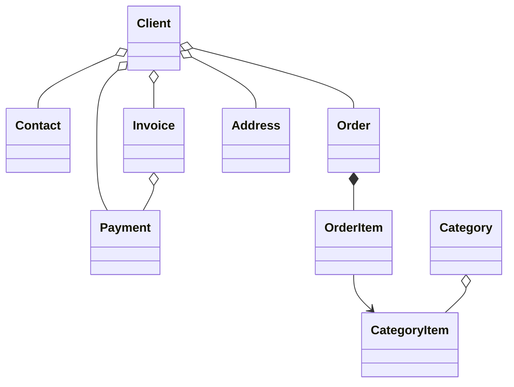

#  B2B CRM

🖥️ [Online Demo](https://demo.jmix.io/b2b-crm/login)

🌐 Jezici: [English](../README.md) | [Русский](README_ru.md) | [Deutsch](README_de.md) | [Italiano](README_it.md) | [Español](README_es.md) | [Srpski](README_srb.md) | [Tiếng Việt](README_vi.md)i.md)

`B2B CRM` je poslovna demonstraciona aplikacija razvijena pomoću Jmix platforme koja prikazuje kako se grade **produkcijski spremni** poslovni sistemi, uključujući `kupce`, `porudžbine`, `fakturisanje`, `finansije` i `analitiku`. <br>
Aplikacija odražava stvarne **ERP/CRM** scenarije i demonstrira najbolje prakse u modeliranju domena, korisničkom interfejsu, bezbjednosti i implementaciji poslovne logike.

## 📑 Sadržaj

- [Pregled](#-pregled)
- [Tehnički stek](#-tehnički-stek)
- [Korišćeni dodaci](#-korišćeni-dodaci)
- [Pokretanje aplikacije](#-pokretanje-aplikacije)
- [AI asistent](#-ai-asistent)
- [Demo podaci](#-demo-podaci)
- [Nalozi](#-nalozi-aplikacije)
- [Model domena](#-model-domena)
- [Model uloga](#-model-uloga)

## 📖 Pregled

Ovaj projekat modeluje tipičan B2B prodajni proces:

- Upravljanje katalogom proizvoda i kategorija
- Održavanje podataka o klijentima i kontaktima
- Praćenje porudžbina i stavki porudžbina
- Izdavanje faktura i evidentiranje uplata
- Postavljanje poslovnih pitanja AI asistentu
- Praćenje zadataka i nedavnih aktivnosti
- Analiza prodajnih rezultata

## 🛠️ Tehnički stek

- Java 21
- Jmix (Spring Boot & Vaadin Flow)
- HSQLDB

## 🧩 Dodaci

- [AI Tools](https://www.jmix.io/marketplace/ai-tools/)
- [Audit](https://www.jmix.io/marketplace/audit/)
- [Application Settings](https://www.jmix.io/marketplace/application-settings/)
- [Charts](https://www.jmix.io/marketplace/charts/)
- [Data tools](https://www.jmix.io/marketplace/data-tools/)
- [Dynamic attributes](https://www.jmix.io/marketplace/dynamic-attributes/)
- [Grid export](https://www.jmix.io/marketplace/grid-export-actions/)
- [Reports](https://www.jmix.io/marketplace/reports/)
- Local file storage, Localizations

## 🚀 Pokretanje i izvršavanje aplikacije

Preduslovi: Java 21+

### Pokretanje projekta

1. Pokrenite Jmix konfiguraciju za pokretanje [B2B CRM](.run/crm-app.run.xml) ili izvršite:

   ```bash
   ./gradlew bootRun
   ```

2. [Otvorite URL aplikacije](http://localhost:8080/b2b-crm)

### Pokretanje putem JAR datoteke

```bash
./gradlew bootJar -Pvaadin.productionMode
```

```bash
java -jar build/libs/crm.jar
```

### Pokretanje putem Docker-a

```bash
docker build -t jmix-crm .
```

```bash
docker run --rm -p 8080:8080 jmix-crm
```

### Pokretanje putem Docker Compose-a

```bash
docker-compose up
```


## 🤖 AI Asistent

Aplikacija uključuje ugrađeni radni prostor `CRM AI` za analizu CRM podataka korišćenjem prirodnog jezika.

Ključne mogućnosti:

- Postavljanje poslovnih pitanja o klijentima, porudžbinama, fakturama, uplatama i rezultatima prodaje
- Poštovanje prava pristupa podacima trenutnog korisnika i čuvanje privatnosti razgovora
- Korišćenje ugrađenih poslovnih izvještaja kao što su `Client 360 Report` i `Category Cashflow Risk Allocation Report`
- Čuvanje istorije razgovora sa automatski generisanim naslovima razgovora
- Otpremanje datoteka u razgovor i analiza podržanih dokumenata i slika
- Generisanje interaktivnih linkova ka CRM zapisima direktno u odgovorima

Konfiguracija:

- Postavite `spring.ai.openai.api-key` u datoteci [application.properties](src/main/resources/application.properties) ili obezbijedite promenljivu okruženja `SPRING_AI_OPENAI_APIKEY`

Kada je funkcionalnost omogućena, otvorite stavku `CRM AI` u glavnom meniju da biste započeli novi razgovor.

## 🎲 Demo podaci

Lokalni profil generiše demo podatke prilikom pokretanja aplikacije:

- Generisanje demo podataka možete onemogućiti pomoću svojstva `crm.generateDemoData`
  u [datoteci application.properties](src/main/resources/application.properties)
- Katalog se uvozi iz datoteke [catalog.xlsx](src/main/resources/demo-data/catalog.xlsx)

## 👥 Korisnički nalozi aplikacije

| Pozicija        | Korisničko ime     | Lozinka  | Pristup                                           |
|-----------------|--------------------|----------|---------------------------------------------------|
| Administrator   | ```admin```        | admin    | Potpun pristup svim podacima i podešavanjima      |
| Supervisor      | ```james```        | james    | Menadžer + upravljanje katalogom + dodjela naloga |
| Manager         | ```manager```      | manager  | Potpun pristup svim klijentima i porudžbinama     |
| Account Manager | ```alice```        | alice    | Vidi samo klijente dodijeljene Alice Brown.       |
| Account Manager | ```robert```       | robert   | Vidi samo klijente dodijeljene Robert Taylor      |

## ⚙️ Model domena



## 🔐 Model uloga

Aplikacija koristi hijerarhijski model uloga:

- `Administrator`: Potpun pristup svim funkcionalnostima aplikacije, entitetima i podešavanjima.
- `Supervisor`: Proširuje ulogu Menadžera dodatnim administrativnim mogućnostima:
    - Upravljanje katalogom proizvoda (kategorije i artikli).
    - Dodjeljivanje menadžera klijenata klijentima.
- `Manager`: Osnovna uloga za prodajne aktivnosti.
    - Potpun pristup klijentima, kontaktima, porudžbinama, fakturama i uplatama.
    - Pristup katalogu proizvoda samo za čitanje.
    - Upravljanje sopstvenim zadacima.
- `UI Minimal`: Minimalan pristup koji omogućava prijavu u sistem i osnovnu navigaciju.
