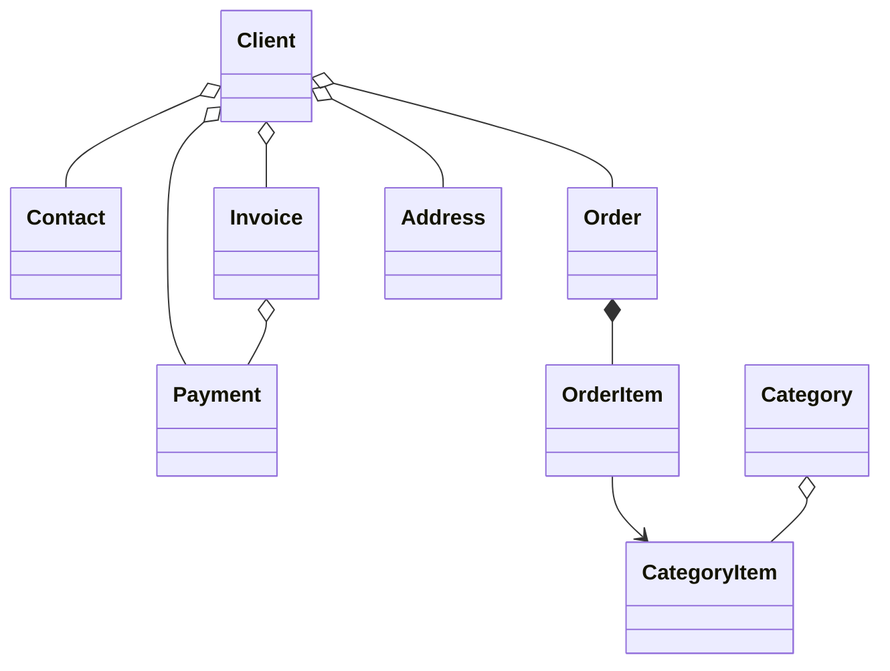

#  B2B CRM

Ngôn ngữ: [English](../README.md) | [Русский](README_ru.md) | [Deutsch](README_de.md) | [Italiano](README_it.md) | [Español](README_es.md) | [Tiếng Việt](README_vi.md) | [Српски](README_sr.md)

`B2B CRM` là một ứng dụng demo doanh nghiệp được xây dựng bằng Jmix, minh họa cách phát triển các hệ thống nghiệp vụ **sẵn sàng cho môi trường sản xuất**
bao gồm `khách hàng`, `đơn hàng`, `lập hóa đơn`, `tài chính` và `phân tích`. <br>Nó phản ánh các kịch bản **ERP/CRM** thực tế và minh họa
các phương pháp tốt nhất trong mô hình hóa miền, UI, bảo mật và triển khai logic nghiệp vụ.

## 📑 Mục lục

- [Tổng quan](#-tổng-quan)
- [Stack công nghệ](#-stack-công-nghệ)
- [Add-on được sử dụng](#-add-on)
- [Build và chạy](#-build-và-chạy)
- [Trợ lý AI](#-trợ-lý-ai)
- [Dữ liệu demo](#-dữ-liệu-demo)
- [Tài khoản](#-tài-khoản-ứng-dụng)
- [Mô hình miền](#-mô-hình-miền)
- [Mô hình vai trò](#-mô-hình-vai-trò)

## 📖 Tổng quan

Dự án này mô hình hóa một quy trình bán hàng B2B điển hình:

- Quản lý danh mục sản phẩm và phân loại
- Duy trì khách hàng và liên hệ
- Theo dõi đơn hàng và mặt hàng đơn hàng
- Phát hành hóa đơn và ghi nhận thanh toán
- Yêu cầu trợ lý AI cung cấp thông tin chi tiết về kinh doanh
- Giám sát nhiệm vụ và hoạt động gần đây
- Xem phân tích bán hàng

## 🛠️ Stack công nghệ

- Java 21
- Jmix 2.8
- Spring Boot 3
- HSQLDB

## 🧩 Add-on

- Audit
- Application settings
- Charts
- Data tools
- Dynamic attributes
- Grid export
- Local file storage
- Reports (bao gồm mẫu hóa đơn)

## 🚀 Build và chạy

Yêu cầu: Java 21+

### Chạy dự án

1. Chạy cấu hình Jmix [B2B CRM](../.run/crm-app.run.xml) hoặc thực thi

   ```bash
   ./gradlew bootRun
   ```

2. [Mở URL ứng dụng](http://localhost:8080/b2b-crm)

### Chạy qua JAR

```bash
./gradlew bootJar -Pvaadin.productionMode
```

```bash
java -jar build/libs/crm.jar
```

### Chạy qua Docker

```bash
docker build -t jmix-crm .
```

```bash
docker run --rm -p 8080:8080 jmix-crm
```

### Chạy qua Docker Compose

```bash
docker-compose up
```

## 🤖 Trợ lý AI

Ứng dụng bao gồm một không gian làm việc `CRM AI` tích hợp sẵn để phân tích dữ liệu CRM bằng ngôn ngữ tự nhiên.

Khả năng chính:

- Đặt câu hỏi kinh doanh về khách hàng, đơn hàng, hóa đơn, thanh toán và hiệu suất bán hàng
- Tôn trọng quyền truy cập dữ liệu của người dùng hiện tại và giữ các cuộc trò chuyện riêng tư cho tác giả của chúng
- Sử dụng các báo cáo kinh doanh tích hợp sẵn như `Client 360 Report` và `Category Cashflow Risk Allocation Report`
- Lưu lịch sử cuộc trò chuyện với các tiêu đề chat được tạo tự động
- Tải tệp lên cuộc trò chuyện và để trợ lý phân tích các tài liệu và hình ảnh được hỗ trợ
- Tạo liên kết tương tác đến các bản ghi CRM trực tiếp trong phản hồi

Cấu hình:

- Đặt `spring.ai.openai.api-key` trong [application.properties](../src/main/resources/application.properties) hoặc cung cấp biến môi trường `SPRING_AI_OPENAI_APIKEY`

Khi đã bật, mở mục `CRM AI` trong menu chính để bắt đầu một cuộc trò chuyện mới.

## 🎲 Dữ liệu demo

Profile local tạo dữ liệu demo khi khởi động ứng dụng:

- Bạn có thể tắt tạo dữ liệu demo với thuộc tính `crm.generateDemoData`
  trong [application.properties](../src/main/resources/application.properties)
- Danh mục được nhập từ [catalog.xlsx](../src/main/resources/demo-data/catalog.xlsx)

## 👥 Tài khoản ứng dụng

| Vị trí          | Tên đăng nhập | Mật khẩu | Quyền truy cập                                          |
|-----------------|---------------|----------|---------------------------------------------------------|
| Administrator   | ```admin```   | admin    | Truy cập đầy đủ vào tất cả dữ liệu và cài đặt           |
| Supervisor      | ```james```   | james    | Manager + quản lý danh mục + chỉ định tài khoản         |
| Manager         | ```manager``` | manager  | Truy cập đầy đủ vào tất cả khách hàng và đơn hàng       |
| Account Manager | ```alice```   | alice    | Chỉ thấy khách hàng được chỉ định cho Alice Brown       |
| Account Manager | ```robert```  | robert   | Chỉ thấy khách hàng được chỉ định cho Robert Taylor     |

## ⚙️ Mô hình miền



## 🔐 Mô hình vai trò

Ứng dụng sử dụng mô hình vai trò phân cấp:

- `Administrator`: Truy cập đầy đủ vào tất cả các tính năng ứng dụng, thực thể và cài đặt.
- `Supervisor`: Mở rộng vai trò Manager với các khả năng quản trị bổ sung:
    - Quản lý danh mục sản phẩm (Categories và Category Items).
    - Chỉ định Account Managers cho Clients.
- `Manager`: Vai trò chính cho các hoạt động bán hàng.
    - Truy cập đầy đủ vào Clients, Contacts, Orders, Invoices và Payments.
    - Truy cập chỉ đọc vào danh mục sản phẩm.
    - Quản lý Tasks của riêng mình.
- `UI Minimal`: Truy cập tối thiểu, cho phép đăng nhập và điều hướng cơ bản.
