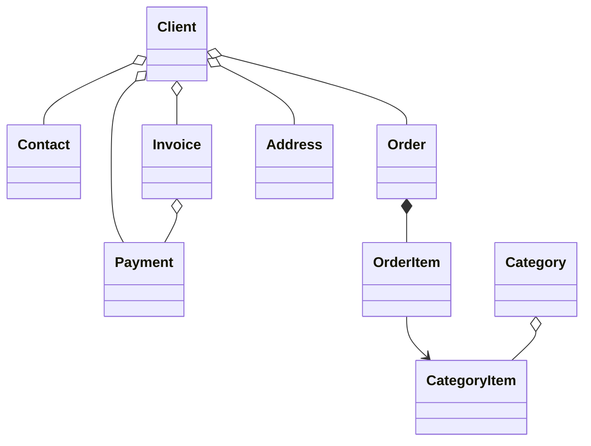

#  B2B CRM

Ngôn ngữ: [English](README.md) | [Русский](README_ru.md) | [Deutsch](README_de.md) | [Italiano](README_it.md) | [Español](README_es.md) | [Srpski](README_srb.md) | [Tiếng Việt](README_vi.md)

`B2B CRM` là ứng dụng doanh nghiệp mẫu được xây dựng bằng nền tảng Jmix, minh họa cách phát triển các hệ thống kinh doanh **sẵn sàng cho môi trường sản xuất**, bao gồm `khách hàng`, `đơn hàng`, `hóa đơn`, `tài chính` và `phân tích dữ liệu`.
Ứng dụng phản ánh các kịch bản **ERP/CRM** thực tế và trình bày các thực tiễn tốt nhất về mô hình hóa nghiệp vụ, giao diện người dùng, bảo mật và triển khai logic nghiệp vụ.

## 📑 Mục lục

- [Tổng quan](#-tổng-quan)
- [Ngăn xếp công nghệ](#-ngăn-xếp-công-nghệ)
- [Các add-on được sử dụng](#-các-add-on-được-sử-dụng)
- [Xây dựng và chạy ứng dụng](#-xây-dựng-và-chạy-ứng-dụng)
- [Trợ lý AI](#-trợ-lý-ai)
- [Dữ liệu mẫu](#-dữ-liệu-mẫu)
- [Tài khoản ứng dụng](#-tài-khoản-ứng-dụng)
- [Mô hình miền](#-mô-hình-miền)
- [Mô hình vai trò](#-mô-hình-vai-trò)

## 📖 Tổng quan

Dự án này mô phỏng quy trình bán hàng B2B điển hình:

- Quản lý danh mục sản phẩm và nhóm sản phẩm
- Quản lý khách hàng và thông tin liên hệ
- Theo dõi đơn hàng và các dòng sản phẩm trong đơn hàng
- Phát hành hóa đơn và ghi nhận thanh toán
- Đặt câu hỏi kinh doanh cho trợ lý AI
- Theo dõi công việc và các hoạt động gần đây
- Xem phân tích doanh số bán hàng

## 🛠️ Ngăn xếp công nghệ

- Java 21
- Jmix (Spring Boot + Vaadin)
- HSQLDB

## 🧩 Các add-on được sử dụng

- Audit
- Application Settings
- Charts
- Data Tools
- Dynamic Attributes
- Grid Export
- Local File Storage
- Reports (bao gồm mẫu hóa đơn)

## 🚀 Xây dựng và chạy ứng dụng

Điều kiện tiên quyết: Java 21+

### Chạy dự án

1. Chạy cấu hình Jmix cho [B2B CRM](.run/crm-app.run.xml) hoặc thực thi:

```bash
./gradlew bootRun
```

2. Mở ứng dụng tại:

http://localhost:8080/b2b-crm

### Chạy bằng JAR

```bash
./gradlew bootJar -Pvaadin.productionMode
```

```bash
java -jar build/libs/crm.jar
```

### Chạy bằng Docker

```bash
docker build -t jmix-crm .
```

```bash
docker run --rm -p 8080:8080 jmix-crm
```

### Chạy bằng Docker Compose

```bash
docker-compose up
```

## 🤖 Trợ lý AI

Ứng dụng bao gồm không gian làm việc `CRM AI` được tích hợp sẵn để phân tích dữ liệu CRM bằng ngôn ngữ tự nhiên.

Các khả năng chính:

- Đặt câu hỏi kinh doanh về khách hàng, đơn hàng, hóa đơn, thanh toán và hiệu suất bán hàng
- Tôn trọng quyền truy cập dữ liệu của người dùng hiện tại và giữ riêng tư các cuộc trò chuyện
- Sử dụng các báo cáo nghiệp vụ tích hợp như `Client 360 Report` và `Category Cashflow Risk Allocation Report`
- Lưu lịch sử hội thoại với tiêu đề được tạo tự động
- Tải tệp lên cuộc trò chuyện và cho phép trợ lý phân tích tài liệu và hình ảnh được hỗ trợ
- Tạo liên kết tương tác đến các bản ghi CRM trực tiếp trong câu trả lời

Cấu hình:

- Thiết lập `spring.ai.openai.api-key` trong [application.properties](src/main/resources/application.properties) hoặc cung cấp biến môi trường `SPRING_AI_OPENAI_APIKEY`

Sau khi được kích hoạt, hãy mở mục `CRM AI` trong menu chính để bắt đầu một cuộc trò chuyện mới.

## 🎲 Dữ liệu mẫu

Hồ sơ cục bộ sẽ tạo dữ liệu mẫu khi ứng dụng khởi động:

- Bạn có thể tắt việc tạo dữ liệu mẫu bằng thuộc tính `crm.generateDemoData` trong [application.properties](src/main/resources/application.properties)
- Danh mục sản phẩm được nhập từ [catalog.xlsx](src/main/resources/demo-data/catalog.xlsx)

## 👥 Tài khoản ứng dụng

| Vai trò         | Tên đăng nhập | Mật khẩu | Quyền truy cập                                         |
|-----------------|---------------|----------|--------------------------------------------------------|
| Administrator   | `admin`       | admin    | Toàn quyền truy cập dữ liệu và cấu hình                |
| Supervisor      | `james`       | james    | Manager + quản lý danh mục + phân công tài khoản       |
| Manager         | `manager`     | manager  | Toàn quyền truy cập khách hàng và đơn hàng             |
| Account Manager | `alice`       | alice    | Chỉ xem khách hàng được gán cho Alice Brown            |
| Account Manager | `robert`      | robert   | Chỉ xem khách hàng được gán cho Robert Taylor          |

## ⚙️ Mô hình miền



## 🔐 Mô hình vai trò

Ứng dụng sử dụng mô hình vai trò phân cấp:

- `Administrator`: Toàn quyền truy cập tất cả tính năng, thực thể và cấu hình của ứng dụng.
- `Supervisor`: Mở rộng vai trò Manager với các khả năng quản trị bổ sung:
    - Quản lý danh mục sản phẩm (Categories và Category Items).
    - Gán Account Manager cho khách hàng.
- `Manager`: Vai trò chính cho hoạt động bán hàng.
    - Toàn quyền truy cập Clients, Contacts, Orders, Invoices và Payments.
    - Chỉ có quyền xem danh mục sản phẩm.
    - Quản lý các Task của chính mình.
- `UI Minimal`: Quyền tối thiểu, cho phép đăng nhập và điều hướng cơ bản.
